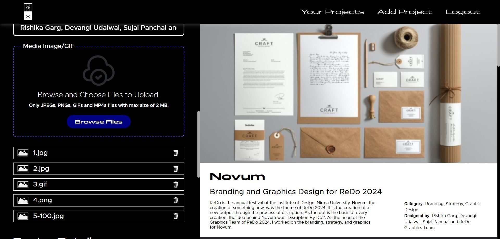

# Rishika Portfolio Website

Client-side Repository is present at <a href="https://github.com/mr-kingshuk/rishi-portfolio-client" target="_blank" rel="noopener noreferrer">rishi-portfolio-server</a>



## Table of Contents
1. [Introduction](#introduction)
2. [Running Loaclly](#running-locally)
3. [Dependencies](#dependencies)
4. [Environment Variables](#environment-variables)
5. [API Reference](#api-reference)
    - [Orders API](#orders-api)
    - [Items-Category API](#items-category-api)
    - [Password API](#password-api)
    - [Store Timing API](#store-timing-api)
    - [Users API](#users-api)
    - [Workers API](#workers-api)
6. [Contributing](#contributing)    
7. [License](#license)

## Introduction

<a href="https://www.linkedin.com/in/rishisdesign/" target="_blank" rel="noopener noreferrer">Rishika Garg</a>, a **3rd-year Communication Design student from Nirma University**, approached me to develop her portfolio website, which she had carefully designed herself. She provided a detailed brief outlining the specific **animations and interactions** she wanted to showcase her work creatively. I accepted this challenge and built a **responsive website** that brought her vision to life, incorporating **seamless animations** and optimizing the **user experience across all devices**. The platform includes:

- <ins>**Advanced Content Management System (CMS)**</ins> with a modern drag-and-drop interface, enabling easy addition and update of projects by the client.
- <ins>**Optimized media uploads to Firebase Storage**</ins>, with strict file type and size restrictions for efficient storage management and reduced upload times.
- <ins>**Smooth image rendering through lazy loading**</ins>, implemented via the Blurhash library to enhance user experience.
- <ins>**Unique animations and user experience**</ins>, powered by the FramerMotion library, which contributed to the client's success in securing internships at leading design firms.
- <ins>**Responsive design**</ins>, ensuring a seamless experience across devices, whether on desktop, tablet, or mobile.
- <ins>**Secure login and password reset functionality**</ins>, ensuring client access and management.
- </ins>**Routing using React Router DOM**</ins>, allowing for efficient navigation between pages.

## Running Locally

## Running Locally

To set up the project locally, follow these steps:

1. **Clone the repositories**:
   - For the server: 
     ```
     git clone https://github.com/mr-kingshuk/rishi-portfolio-server.git
     ```
   - For the client: 
     ```
     git clone https://github.com/mr-kingshuk/rishi-portfolio-client.git
     ```

2. **Fill the `.env` file**: 
   - Use the `template.env` file as a reference to configure your environment variables.

3. **Set up the database connection in the server**:
   - Add the database connection string of MongoDB from the MongoDB Atlas.

4. **Install dependencies and run the server and client**:
   - Navigate to the server folder:
     ```bash
     cd rishi-portfolio-server
     npm install
     npm run dev
     ```
   - Then, navigate to the client folder:
     ```bash
     cd ../rishi-portfolio-client
     npm install
     npm run dev
     ```

5. **Add Admin User**:
   - Call the POST endpoint to add admin, with request body having the `email` and the `password`:
     ```
     POST http://localhost:3000/api/users/signup
     ```

## Dependencies

```json
  "dependencies": {
    "bcrypt": "^5.1.1",
    "cors": "^2.8.5",
    "dotenv": "^16.3.1",
    "express": "^4.18.2",
    "jsonwebtoken": "^9.0.2",
    "mongoose": "^8.0.3",
    "morgan": "^1.10.0",
    "nodemailer": "^6.9.13",
    "validator": "^13.11.0"
  },
  "devDependencies": {
    "nodemon": "^3.0.2"
  }
```

## Environment Variables

To run this project, you will need to add the following environment variables to your `.env` file:

- `PORT`: The port number on which the server will run.
- `MONGO_URI`: The connection string for your MongoDB database.
- `SECRET`: The secret key for JWT authentication.
- `BASE_URL_SERVER`: The base URL of the server.
- `BASE_URL_CLIENT`: The base URL of the client application.
- `EMAIL`: The email address from which emails are sent.
- `PASSWORD_APP_EMAIL`: The less secure password for the email account used to send emails.

## API Reference
### Orders API

## Contributing 

This project is currently open-sourced for review purposes, particularly for recruiters and potential collaborators. While contributions are not actively sought, if you find any issues or have suggestions for improvement, feel free to fork the repository and submit a pull request. Your insights are always welcome.

## License

**Copyright (c) 2024 Kingshuk Ghosh** — Licensed under the MIT License. [MIT License Link](https://opensource.org/license/mit)
